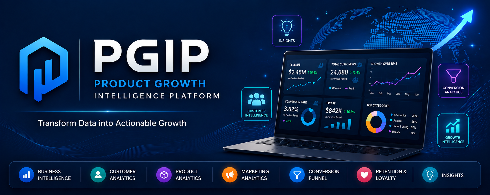
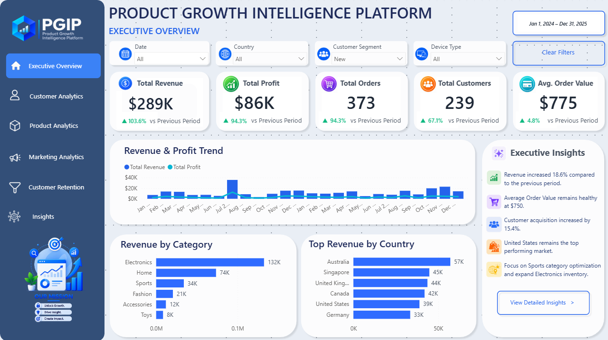
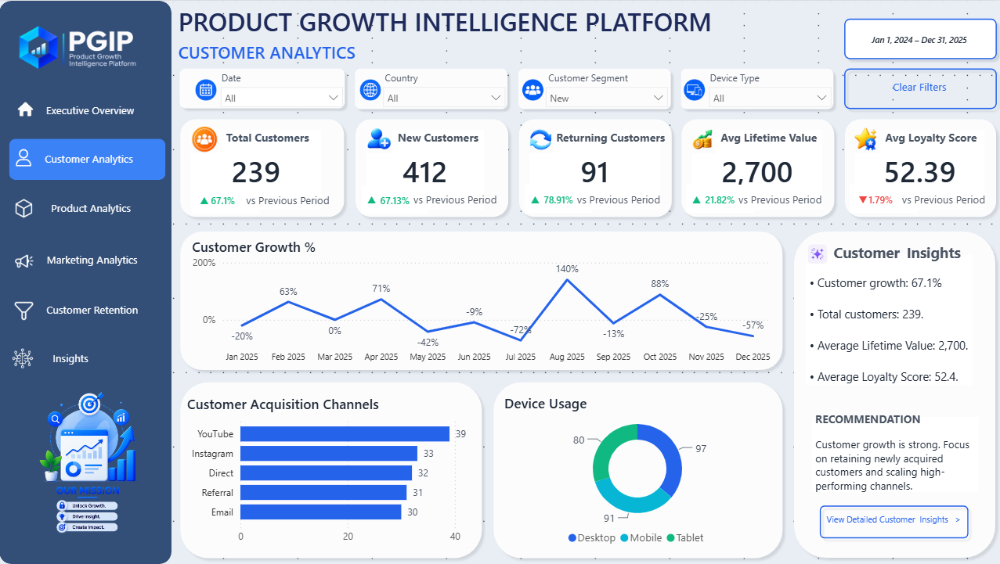
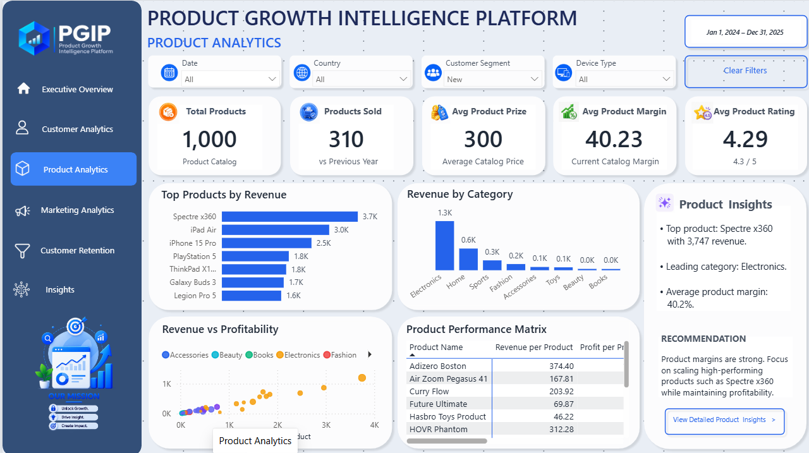
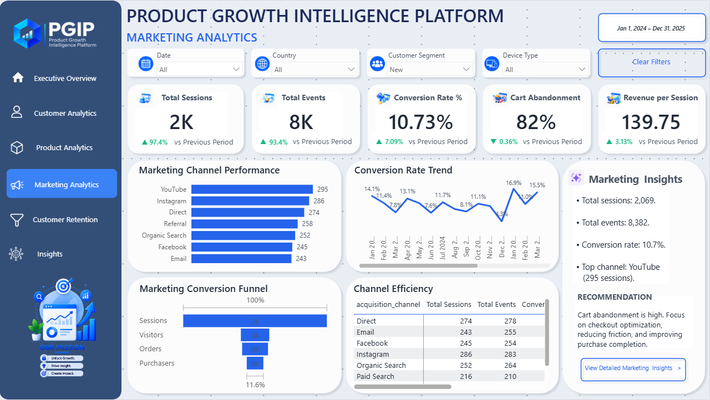
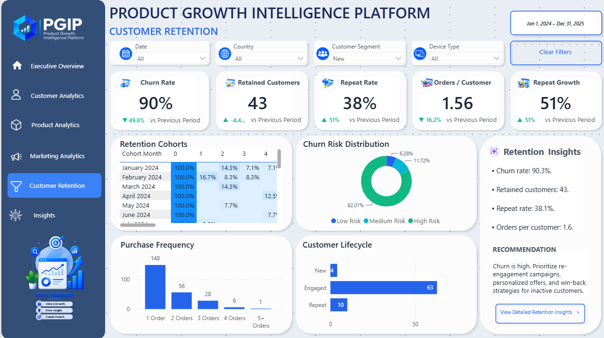
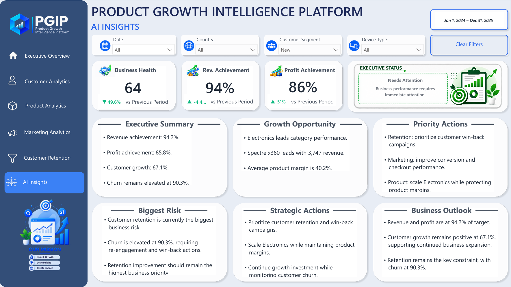
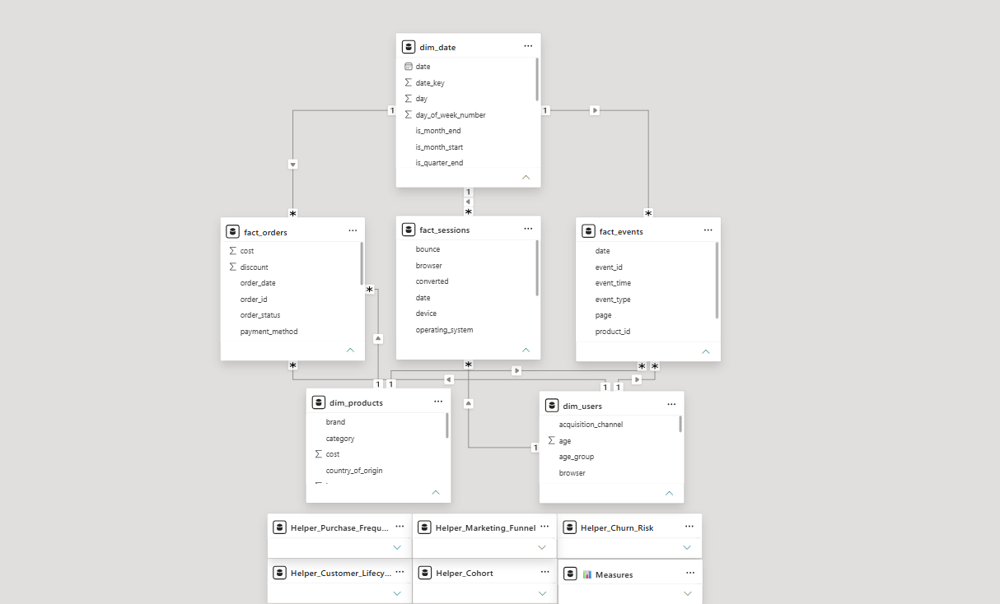

<p align="center">
  
</p>

<h1 align="center">📈 Product Growth Intelligence Platform</h1>

<p align="center">
  <strong>Enterprise-Style Product, Customer & Growth Analytics using Microsoft Power BI</strong>
</p>

<p align="center">
  
  
  
  
  
</p>

---

## 📌 Project Overview

The **Product Growth Intelligence Platform (PGIP)** is a portfolio-grade Business Intelligence and Product Analytics solution built with **Microsoft Power BI**.

PGIP unifies:

- Business performance
- Customer analytics
- Product analytics
- Marketing and conversion funnel analytics
- Customer retention analytics
- AI-assisted executive insights

The platform connects:

**Data → KPIs → Analysis → Insights → Recommendations → Action**

It is positioned as a **Product Growth Intelligence Platform**, rather than a conventional Power BI reporting dashboard.

---

## 🎯 Business Problem & Objectives

Product and growth teams need visibility beyond revenue and profit. Customer behavior, product performance, marketing effectiveness, conversion, and retention all influence business growth.

Analyzing these areas separately can make it difficult to identify performance drivers, risks, and opportunities.

### Objectives

PGIP was designed to:

- Monitor business performance through executive KPIs
- Analyze customer growth, value, behavior, and lifecycle
- Evaluate product and category performance
- Measure marketing engagement and conversion
- Analyze the visitor-to-purchase journey
- Monitor churn, retention, repeat behavior, cohorts, and customer lifecycle
- Identify risks and growth opportunities
- Convert analytical results into executive insights
- Support data-driven recommendations
- Demonstrate Power BI, DAX, Power Query, SQL, and data modeling skills

---

## ❓ Key Business Questions

| Domain | Key Questions |
|---|---|
| **Executive** | How are revenue, profit, targets, and overall business health performing? |
| **Customer** | How is the customer base growing? What is the value and behavior of customers? |
| **Product** | Which products and categories drive revenue and profitability? |
| **Marketing** | How effectively are sessions and engagement generating business outcomes? |
| **Funnel** | Where are users dropping off between visitors and purchases? |
| **Retention** | How are churn, retention, customer lifecycle, and repeat behavior changing? |
| **Growth** | Where are the strongest opportunities, risks, and priority actions? |

---
---

## 📊 Dashboard Architecture

PGIP consists of **six interconnected analytical pages**:

| # | Dashboard Page | Primary Focus |
|---|---|---|
| 01 | **Executive Overview** | Business performance & executive KPIs |
| 02 | **Customer Analytics** | Customer growth, value & behavior |
| 03 | **Product Analytics** | Product & category performance |
| 04 | **Marketing Analytics** | Marketing, engagement & conversion |
| 05 | **Customer Retention** | Churn, retention & customer lifecycle |
| 06 | **AI Insights** | Executive intelligence, risks & recommendations |

All six pages share a consistent PGIP navigation, filtering system, KPI design, and enterprise-style visual language.
# 📸 Dashboard Pages

## 01 — Executive Overview

Provides an executive-level view of overall business performance through revenue, profit, orders, customers, AOV, trends, category performance, country performance, and executive insights.

<p align="center">
  
</p>

---

## 02 — Customer Analytics

Analyzes customer growth, new and returning customers, lifetime value, loyalty, acquisition channels, customer growth trends, and device usage.

<p align="center">
  
</p>

---

## 03 — Product Analytics

Analyzes product catalog performance, top products, category revenue, revenue versus profitability, product performance, pricing, margins, and ratings.

<p align="center">
  
</p>

---

## 04 — Marketing Analytics

Analyzes sessions, events, conversion rate, cart abandonment, revenue per session, marketing channels, conversion trends, funnel performance, and channel efficiency.

<p align="center">
  
</p>

---

## 05 — Customer Retention

Analyzes churn rate, retained customers, repeat rate, orders per customer, repeat growth, retention cohorts, purchase frequency, churn risk, and customer lifecycle.

<p align="center">
  
</p>

---

## 06 — AI Insights

Provides an executive decision-support layer covering business health, revenue and profit achievement, biggest risks, growth opportunities, strategic actions, business outlook, and executive recommendations.

<p align="center">
  
</p>

## 🔎 Interactive Analysis

The dashboard supports dynamic analysis through:

- **Date**
- **Country**
- **Customer Segment**
- **Device Type**
- **Clear Filters**

These filters allow users to explore performance across different time periods, markets, customer groups, and devices.

---

## 🎨 Design System

PGIP follows a consistent enterprise SaaS-style visual system:

- Dark navy sidebar
- Light blue-gray report background
- White rounded analytical cards
- Blue primary accent
- Green positive-performance indicators
- Orange warning/highlight elements
- Purple/cyan supporting accents
- Consistent typography and spacing
- Unified navigation and AI insight panels

The same visual language is maintained across all six pages so the report functions as one integrated analytics platform.

---

## 🧭 Navigation

The PGIP sidebar provides access to six analytical pages:

1. Executive Overview
2. Customer Analytics
3. Product Analytics
4. Marketing Analytics
5. Customer Retention
6. AI Insights

The active page uses a highlighted navigation state, while the sidebar maintains the consistent PGIP branding and visual system.
## 🗂️ Data Architecture & Model

PGIP uses a structured multi-fact analytical model combining transactional, customer, product, session, and behavioral data.

### Core Tables

| Table | Type | Purpose |
|---|---|---|
| `dim_date` | Dimension | Date and time-intelligence analysis |
| `dim_users` | Dimension | Customer and user attributes |
| `dim_products` | Dimension | Product and category attributes |
| `fact_orders` | Fact | Orders, revenue, profit, quantity, and transactions |
| `fact_sessions` | Fact | Sessions, visitors, engagement, and conversion activity |
| `fact_events` | Fact | User events and behavioral activity |

### Analytical Helper Tables

| Table | Purpose |
|---|---|
| `Helper_Purchase_Frequency` | Purchase-frequency analysis |
| `Helper_Customer_Lifecycle` | Customer lifecycle classification |
| `Helper_Marketing_Funnel` | Funnel and related analytical analysis |
| `Helper_Cohort` | Cohort and retention analysis |
| `Helper_Churn_Risk` | Churn-risk and executive intelligence |
| `📊 Measures` | Centralized DAX measure repository |

<p align="center">
  
</p>

--- 

## 🔄 Data Preparation & Analytics Workflow

The project follows an end-to-end workflow from source data to business decision support:

Source Data
    ↓
Data Inspection & Cleaning
    ↓
SQL Analysis / Transformation
    ↓
Power Query
    ↓
Power BI Data Model
    ↓
DAX & KPI Development
    ↓
Interactive Dashboards
    ↓
Insights & Executive Intelligence
    ↓
Business Recommendations

## 🧮 DAX & KPI Framework

DAX powers the project's reusable business calculations, KPI logic, rankings, time intelligence, and executive intelligence.

### Measure Organization

📊 Measures
├── AI
├── Customer
├── Executive
├── Funnel
├── KPIs
├── Marketing
├── Products
├── Rankings
└── Time Intelligence


### KPI Framework

| Area | Key Metrics |
|---|---|
| **Executive** | Business Health, Revenue Achievement %, Profit Achievement % |
| **Business** | Revenue, Profit, Orders, Customers, AOV, Profit Margin % |
| **Customer** | Customer Growth %, New Customers, Returning Customers, Lifetime Value, Loyalty |
| **Product** | Product Revenue, Product Profit, Product Margin, Price, Rating |
| **Marketing** | Sessions, Events, Conversion %, Cart Abandonment %, Revenue/Session |
| **Funnel** | Visitors, Purchasers, Visitor Conversion %, Checkout Success %, Engagement |
| **Retention** | Churn, Retention, Purchase Frequency, Customer Lifecycle, Cohorts |
| **Time Intelligence** | YTD, Previous Period, Previous Year, Growth %, Running Revenue |

### Executive Intelligence

DAX measures support dynamic executive outputs including:

- Business Health
- Executive Status
- Revenue & Profit Achievement
- Biggest Risk
- Growth Opportunity
- Priority Actions
- Business Outlook
- Executive Summary

Measures are centralized in the `📊 Measures` table and organized into analytical display folders for consistent KPI definitions, reusable calculations, and easier model maintenance.

---

## ⚙️ Dashboard Features

- Interactive Date, Country, Customer Segment, and Device Type filters
- KPI cards with previous-period comparisons
- Revenue and customer growth analysis
- Product and category performance analysis
- Marketing channel and conversion analysis
- Conversion funnel analysis within Marketing Analytics
- Retention cohorts and churn-risk analysis
- Customer lifecycle and purchase-frequency analysis
- AI-assisted insight and recommendation panels
- Executive risk, opportunity, outlook, and priority-action analysis

---

# 💡 Key Business Insights & Strategic Recommendations

PGIP is designed to move beyond descriptive reporting by connecting KPI performance with business interpretation and recommended actions.

### Key Insights

The Executive Overview analysis highlights several important business signals:

- Revenue is showing positive movement versus the previous period.
- Revenue and profit both show strong positive movement versus the previous period.
- Customer acquisition is showing positive growth.
- Electronics is the strongest revenue-generating category in the displayed analysis.
- Sports category optimization and Electronics inventory expansion are identified as potential opportunities.

### Strategic Recommendations

| Area | Recommended Action |
|---|---|
| **Customer** | Prioritize retention and win-back strategies for customers showing declining engagement |
| **Product** | Scale strong-performing categories while monitoring profitability and margins |
| **Marketing** | Investigate funnel drop-offs and improve conversion efficiency |
| **Retention** | Monitor churn, lifecycle changes, loyalty, and high-value customer behavior |
| **Executive** | Track revenue/profit achievement and prioritize emerging risks and opportunities |

### Decision-Support Framework

**Performance → Diagnosis → Risk / Opportunity → Recommendation → Action**

PGIP therefore supports both performance monitoring and the next stage of business decision-making.

---

# 🛠️ Technology Stack & Workflow

| Technology | Purpose |
|---|---|
| **Microsoft Power BI** | Interactive dashboards, reporting, and visualization |
| **DAX** | KPIs, business logic, rankings, time intelligence, and executive intelligence |
| **Power Query** | Data transformation and preparation |
| **SQL** | Data querying and analytical preparation |
| **Data Modeling** | Relationships, dimensions, facts, and analytical structures |
| **GitHub** | Project documentation and version control |

### End-to-End Workflow

Data
 ↓
SQL / Power Query
 ↓
Data Modeling
 ↓
DAX & KPI Development
 ↓
Power BI Dashboards
 ↓
Analytical Insights
 ↓
Executive Intelligence
 ↓
Business Recommendations

---


# 📁 Project Structure & Usage

```text
Product-Growth-Intelligence-Platform/
│
├── README.md
├── Images/
│   ├── banner.png
│   ├── executive-overview.png
│   ├── customer-analytics.png
│   ├── product-analytics.png
│   ├── marketing-analytics.png
│   ├── customer-retention.png
│   ├── ai-insights.png
│   └── data-model.png
│
├── Power BI/
│   └── Product Growth Intelligence Platform.pbix
│
├── ai/
│   ├── data_loader.py
│   ├── database.py
│   ├── insight_generator.py
│   ├── main.py
│   ├── report_generator.py
│   └── Executive_Report.md
│
├── data_generator/
│   ├── generators/
│   ├── output/
│   ├── tests/
│   ├── utils/
│   ├── config.py
│   ├── constants.py
│   ├── main.py
│   └── requirements.txt
│
└── sql/
    ├── 01_business_kpis.sql
    ├── 02_customer_analytics.sql
    ├── 03_product_analytics.sql
    ├── 04_marketing_analytics.sql
    ├── 05_conversion_funnel.sql
    ├── 06_retention_analysis.sql
    ├── 07_executive_dashboard.sql
    ├── ai_views.sql
    ├── functions.sql
    ├── indexes.sql
    ├── procedures.sql
    ├── relationships.sql
    ├── schema.sql
    └── views.sql
```

### How to Use

1. Open the `.pbix` file using **Microsoft Power BI Desktop**.
2. Review the data model, relationships, helper tables, and DAX measures.
3. Navigate through the six dashboard pages.
4. Use the available filters to explore different business contexts.
5. Analyze KPIs, trends, funnel performance, retention metrics, and executive insights.

# 🔮 Future Enhancements

Potential extensions toward a more production-oriented analytics platform include:

- Automated scheduled data refresh through Power BI Service
- Row-level security for different business teams
- Automated KPI threshold alerts
- Predictive churn modeling
- Customer lifetime value forecasting
- Revenue and demand forecasting
- Advanced marketing attribution
- Automated anomaly detection
- Real-time product and event data integration
- Microsoft Fabric-based analytics architecture

> These are proposed future enhancements and are not represented as functionality currently implemented in the completed project.

---

# 👤 Author

**Muhammed Irshad**

**Data Analyst | Business Intelligence | Power BI | SQL | Python**

Focused on transforming business data into actionable insights through analytics, visualization, and data-driven decision-making.

---

<p align="center">
  <strong>Product Growth Intelligence Platform</strong><br>
  Transform Data into Actionable Growth.
</p>
